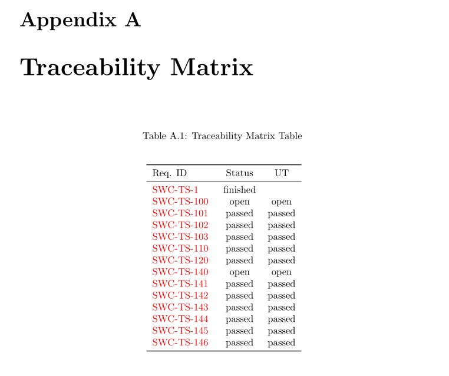

# Introduction

## Purpose and Outline

This slideshow provides an overview over the new features not mentioned in the presentation below.

* Provide an introduction into the traceability features 
* Export and import of *xlsx* files
* Show missing features and how to solve them

An introduction into *rmtoo* is available \href{https://github.com/florath/rmtoo/releases/download/v23/rmtooIntroductionV9.pdf}{here} 
and in more detail \href{https://github.com/florath/rmtoo/releases/download/v23/rmtooDetailsV5.pdf}{here}.

# Traceability

## The Scenario

Imagine your customer has provided you with *the perfect* requirements document.
You've written your code and tests and your traceability matrix is perfect.

Enter the *change request*:

* some requirements have changed, and
* some other code has to be changed as well.

## Your Problems

* Keep requirements and code synced
* Update test specification and keep tests synced
* Traceability matrix must remain correct
    * Filled out completely

## What you want

* Code and requirements belong together
    * Same repository
	* CI runs unit-tests 
	* CI creates traceability matrix automatically
* Unit-tests point to test specification
    * Changes to tests must be reflected in test specification
	* Manual work 
	* No silver bullet (only golden ones)
	* *Backwards* arrow in V-model
* Changes to test specification must fail CI toolchain
    * For unchanged unit-tests
    * Link not obvious from specification
	* CI tool must validate 
	* *Forwards* arrow in V-model
	
	
## Available Solutions

* Web based solutions
    * We've just seperated our requirements from our code
    * Does it fail your build?
	    * Probably not and you're late, so ship anyways
		* you'll be in trouble
	* Your web-page isn't working in three years when the customer comes around
* DOORS
    * They're over there $\rightarrow$
* Manual Reports
    * Manually verify a traceability matrix twice and your engineers will use that golden bullet against you.
	* Processes will not be followed, unless customer insists, e.g., ECSS or EN50128 is required.
	* YMMV, but questionable correctness

# rmtoo Traceability

## Backwards

Every specification-item has a name, e.g., ``SWC-TS-102``. Every unit-test lists the specifications it solves.

The following unit-test will test the aforementioned  *software component test specification* item *102*.

\vfill

```python
    def test_adding_req(self, record_property):
        record_property('req', 'SWC-TS-102-96ac8522')
		assert True
```

## Forwards

The previously test requirement ``SWC-TS-102`` will change and with it it's hash-value.

Hence the test on the previous page will fail the traceability matrix because the hash **96ac8522** 
has changed.

Time for your engineer to ensure if/what needs to change.

\vfill

```python
    def test_adding_req(self, record_property):
        record_property('req', 'SWC-TS-102-96ac8522')
		assert True
```

## Example

New developements have a test specification in the ``testspe`` folder. 




## Specifications


* 

# Final Thoughts
## Public Service Announcement

* Never test against your requirements
    * Always write some form of test specification
    * Consider cucumber for acceptance testing

* Big Bullet Points \href[page=5]{Architects Master Class.pdf}{page 5 ff.}

## Nucular Option

* Being agile and doing Agile is like being your sister and doing your ...

## Pile of burning trash

* Which code has to change?
    * Whatever your architect tells you to do.
* Which tests have to change?
    * The one whose requirements have changed. 
	* Your RM Tool will tell you this
* Is your traceability matrix correct?


	
* do everything in your CI tool
* git is your friend
* how do we know which tests to change if a requirement changes?
